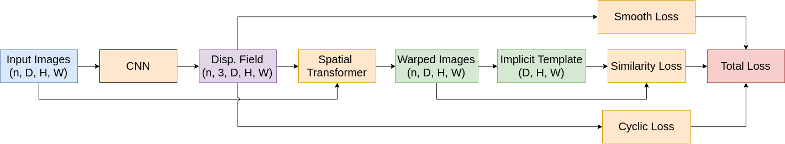
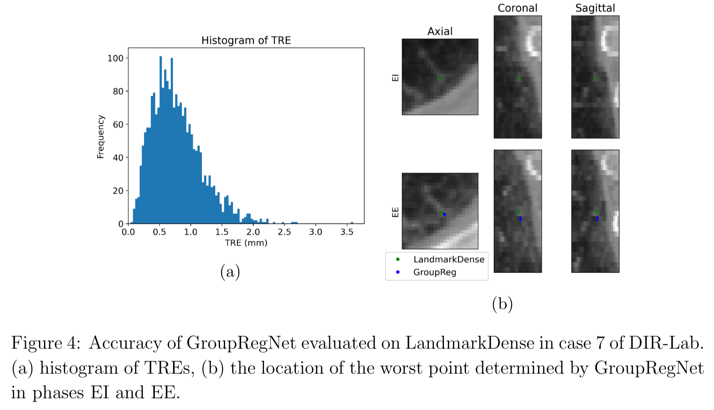
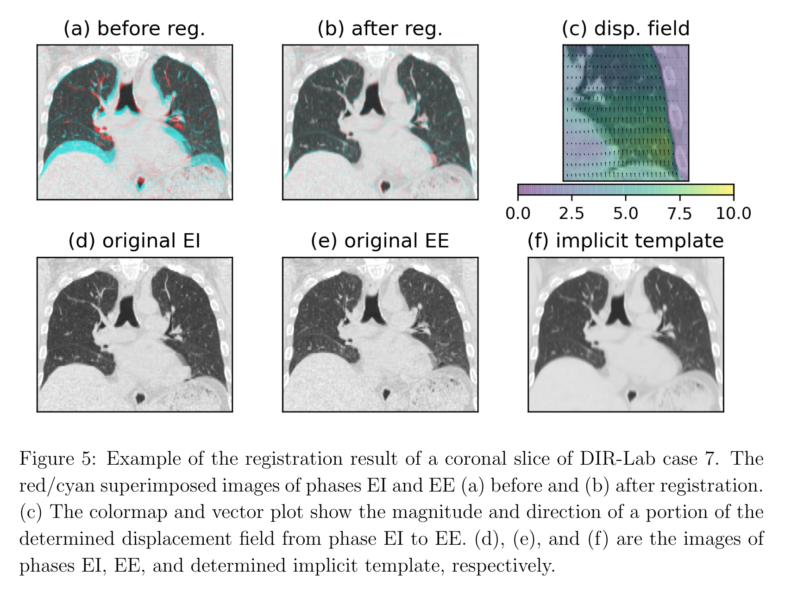
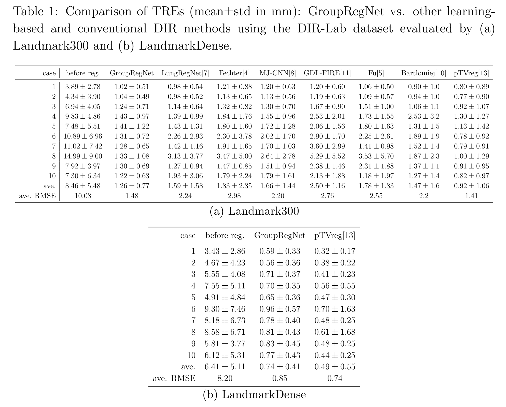
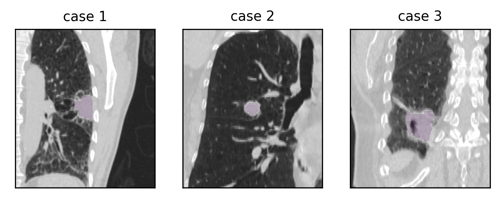
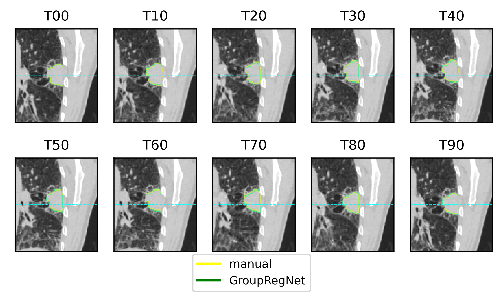
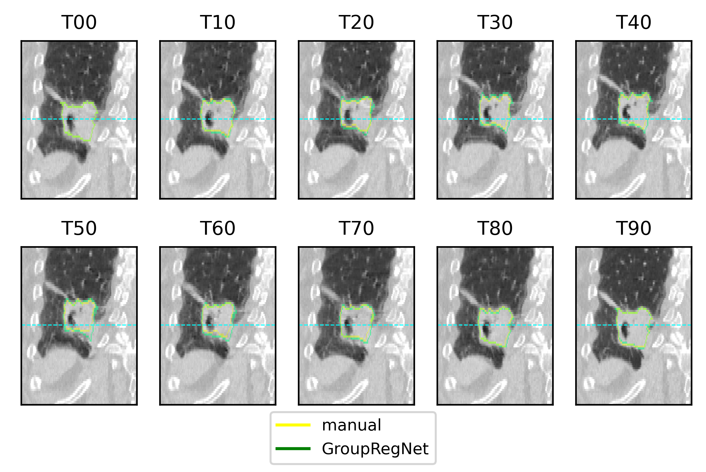

# GroupRegNet
Implementation of [GroupRegNet: A Groupwise One-shot Deep Learning-based 4D Image Registration Method](https://iopscience.iop.org/article/10.1088/1361-6560/abd956). 
Zhang, Y., Wu, X., Gach, H. M., Li, H. H., & Yang, D. (2021). GroupRegNet: a groupwise one-shot deep learning-based 4D image registration method. Physics in Medicine & Biology.

GroupRegNet is an unsupervised deep learning-based DIR method that employs both groupwise registration and one-shot strategy to register 4D medical images and then to determine all pairwise deformation vector fields (DVFs). 

## Requirement

- PyTorch
- SimpleITK: read mhd files
- logging and tqdm

## Usage

To evaluate GroupRegNet with `registration_dirlab.py`, the [DIR-Lab](https://www.dir-lab.com/index.html) dataset is required. The original data needs to be converted into mhd format. 

To convert the original landmark of Landmark300 and LandmarkDense, run `convert_landmark_dirlab300.py` and `convert_landmark_dense.py`. 

## Overall structure

## Result

Sizes, shapes, and locations of the contoured tumor targets, shown in violet shade, in coronal views of the EI phases of three patient cases.

Comparison of the tracked targets in ten phases by GroupRegNet and manual contouring of case 1 and 3. The images are shown in coronal views, and the horizontal line in each figure is at the same height for visual reference.

